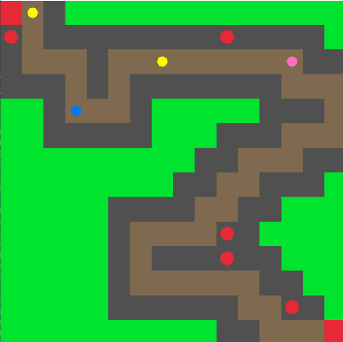

# AI GAME REPORT
# DEFEND THE NEXUS
**Project Report Submitted By**

Mugilkrishna D U             3122 22 5001 073

Nikilesh Jayaguptha          3122 22 5001 081

Department of Computer Science and Engineering

## **1. INTRODUCTION :**

**1.1 GAME OVERVIEW**

Defend the Nexus is an engaging, strategy-based game where players must strategically position and upgrade towers to protect a vital energy source, known as the Nexus, from waves of diverse enemies. The players must prevent the enemies from reaching the Nexus by placing towers along the path. These towers automatically attach to the enemies that pass by. The game emphasizes resource management, requiring players to balance investments in towers and upgrades to survive increasingly difficult waves.

**1.2 GAME FEATURES**

*Dynamic Pathfinding Using A star Algorithm:*

The game employs the A* pathfinding algorithm, allowing enemies to find the optimal route from their spawn point to the Nexus. The algorithm calculates paths in real-time, making enemy movement more unpredictable and challenging for the player.

*Strategic Tower Placement and Upgrades:*

Players can strategically place up to five turrets on designated grid positions (represented by map data) to defend the Nexus. Each turret has customizable properties, such as attack_cooldown, attack_timer, hitpos, and damage, which define their firing rate, range, and impact. Turrets automatically target enemies within range, adding a layer of strategy and requiring players to consider placement and upgrade timing.

*Resource Management and Progressively Difficult Waves:*

The game introduces a balance between defense and resource allocation. Players must allocate resources wisely, choosing between adding new turrets and upgrading existing ones as waves become progressively more difficult. Enemy health is represented visually through color changes, from BLUE (full health) to BLACK (near defeat), adding feedback for players to adjust their strategies.

*Real-Time Enemy Updates and Damage System:*

The code includes dynamic, real-time updates for enemy positions, health, and progression along the path. Each enemy’s health is modified upon receiving damage from turrets, and if it reaches zero, the enemy is removed from the list, while the turret logs a kill and accumulates damage statistics.

*Detailed Turret and Enemy Performance Metrics:*

Turrets track individual performance metrics, such as kills and damage dealt, throughout the game. These metrics are displayed at the end of each wave, giving players insights into the effectiveness of their turret placements and damage output. Total kills and damage output are calculated and printed for strategic assessment.

*Visual Map Rendering with Customizable Colors:*

The game’s environment is created using a customizable 2D grid map, rendered with various colors for different map elements, such as GREEN for open paths, BROWN for path sections, RED for the Nexus points, and DARKGRAY for possible turret placements. This intuitive layout helps players plan their defense strategy at a glance.

*Real-Time Mouse Interactions for Intuitive Gameplay:*

Mouse interactions allow players to select turret positions in real-time. When the left mouse button is clicked, a turret is placed on the specified grid location if it meets game conditions. This simple, interactive control scheme enhances user engagement, enabling quick adjustments and fast-paced decision-making.

*Adaptive Enemy Waves with Spawn Management:*

The game features an adaptive spawn management system, where enemy waves spawn based on a timer and a maximum enemy limit. The variable spawn_interval controls the frequency of enemy spawns, ensuring a steady increase in difficulty.

**1.3 SCOPE OF THE GAME**

**Game Strategy**

Resource Management: Players must allocate resources efficiently, balancing between adding new turrets and upgrading existing ones.

Defensive Positioning: Strategically place turrets along the enemy path to maximize their impact and cover critical areas.

Adaptability: Players adjust strategies to counter different enemy types and escalating wave difficulties.

**Player Engagement**

Progressive Challenge: Enemy waves increase in complexity, keeping players engaged and continuously challenged.

Real-Time Feedback: Immediate feedback on turret performance and enemy health adds an interactive, dynamic experience.

Rewarding Performance Metrics: Players receive end-of-game stats on turret effectiveness, total damage, and kills, encouraging replay and improvement.

**Educational Benefits**

Strategic Thinking: Encourages planning and adaptability as players tackle various wave patterns and enemy behaviors.

Pathfinding and AI Awareness: Introduces players to A* pathfinding and basic AI mechanics used in enemy movement.

Math and Logic Skills: Players use logical reasoning and numerical thinking for resource allocation and performance tracking.

**Game Customization and Extensions**

Adjustable Difficulty: Options for increased enemy health, faster wave intervals, or resource scarcity provide varied challenge levels.

Expansion Potential: Additional turret types, enemy abilities, and customizable maps can extend gameplay and create new strategies.

AI Integration: With more advanced AI opponents, players could practice solo or experiment with different defensive tactics.

## **2. METHODOLOGY :**

**2.1 ALGORITHM SELECTION**

In creating AI for our competitive game, selecting the appropriate algorithm is essential for achieving optimal AI performance and strategy. For this game, we implemented two distinct approaches to accommodate both User vs AI and AI vs AI gameplay modes. The AI for these modes is built upon advanced search algorithms that allow for efficient and strategic decision-making.

**Normal Game Mode (User vs AI): A-star Algorithm**
In User vs AI mode, we used the A* (A-star) algorithm, a powerful search-based algorithm that is highly effective for decision-making in complex, path-dependent environments.

*A star Algorithm*: The A* algorithm combines elements of pathfinding with heuristic optimization, making it ideal for scenarios where the AI needs to evaluate the cost of reaching future game states. It works by balancing two factors:

g(n): The actual cost of reaching a specific game state from the initial position.
h(n): A heuristic estimate of the cost to reach a favorable end state from the current position.

By combining these two factors, A* prioritizes moves that are likely to lead to a beneficial game outcome, searching paths that appear promising based on both immediate gains and future potential. This makes it a highly effective algorithm for User vs AI gameplay, where the AI's goal is to anticipate the user's moves and navigate the game space toward a winning strategy.

**Simulated Mode (AI vs AI): Simulated Annealing**
For AI vs AI simulations, we use Simulated Annealing, an algorithm that introduces probabilistic variation to allow the AI to explore a broader range of moves and strategies.

*Simulated Annealing*: This algorithm allows the AI to make decisions with an element of randomness, balancing the pursuit of optimal moves with a tolerance for suboptimal moves. The degree of randomness is controlled by a temperature parameter, which decreases over time to reduce the likelihood of choosing lower-quality moves as the game progresses. This approach enables the AI to explore diverse strategies and adapt dynamically within the game space, creating a varied and realistic AI performance.

## **3. IMPLEMENTATION :**

**3.1 DESIGN DETAILS**

In our game design, there are three core components that structure the gameplay and user experience across both User vs AI and AI vs AI modes:

1. Game Board Matrix

The primary layout for the game is based on a grid matrix that serves as the playing area. Each position in this grid represents a potential move space, allowing the user and AI to navigate and strategize based on available moves.
The dimensions of the matrix may vary based on the game specifications but typically follow a standard square or rectangular layout to facilitate easy navigation and consistent visual symmetry.

2. Move Nodes

Each grid cell within the matrix contains a node that represents an individual move space. These nodes serve as the focal points for both user and AI moves, where each move corresponds to occupying a specific node within the matrix.
The node’s state is updated visually as either empty, occupied by the user, or occupied by the AI, allowing for clear and immediate feedback to both players.

3. Move Selector and Navigation Interface

A navigation bar or selection indicator is located at the top of the screen, allowing users to select columns (in User vs AI mode) or visualize AI moves (in AI vs AI mode).
In User vs AI mode, users interact with this bar to select their move position. The bar dynamically highlights potential move spaces within a column, giving users a clear guide for where their move will be placed.
For AI vs AI simulations, the navigation interface updates automatically to display AI move decisions, giving a real-time view of AI actions and strategy throughout the game.

**3.3 IMPLEMENTATION OF THE ALGORITHMS**

**Simulated Annealing**

**Code**
```python
import random
import math

def simulated_annealing(board, temp, cooling_rate):
    current_state = board
    current_value = evaluate(current_state)

    while temp > 1:
        neighbor_state = generate_neighbor(current_state)
        neighbor_value = evaluate(neighbor_state)
        
        # Calculate the acceptance probability
        if neighbor_value > current_value:
            acceptance_probability = 1.0
        else:
            acceptance_probability = math.exp((neighbor_value - current_value) / temp)

        # Decide whether to accept the neighbor state
        if acceptance_probability > random.uniform(0, 1):
            current_state = neighbor_state
            current_value = neighbor_value

        # Decrease temperature
        temp *= cooling_rate

    return current_state

def generate_neighbor(state):
    # Generate a neighboring state by randomly moving one piece
    neighbor = [row[:] for row in state]
    # Randomly select a position and modify it slightly
    # Example logic: swap positions, or add/subtract values in the state
    return neighbor

def evaluate(state):
    # Evaluation function for scoring the board state
    score = 0
    # Scoring logic based on board configuration
    return score
```

The Simulated Annealing algorithm, utilized in AI vs AI gameplay mode, starts with a current game state (the board) and iteratively attempts to find a better solution by exploring neighboring states. At each step, it evaluates the neighboring state and decides whether to accept it based on a calculated acceptance probability, which allows it to accept even non-optimal moves early in the process. Over time, as the temperature (temp) decreases, the likelihood of accepting worse states declines, focusing the search on more promising states. This approach helps approximate an optimal solution efficiently by gradually narrowing the search space.

**A star Algorithm**

**Code**
```python
import heapq

class GameState:
    def __init__(self, board, g_cost, h_cost, parent=None):
        self.board = board
        self.g_cost = g_cost   # Cost from start to this node
        self.h_cost = h_cost   # Heuristic cost estimate to goal
        self.parent = parent
        self.f_cost = g_cost + h_cost

    def __lt__(self, other):
        return self.f_cost < other.f_cost

def a_star(board, goal_state):
    open_list = []
    closed_list = set()
    start_state = GameState(board, 0, heuristic(board, goal_state))
    
    heapq.heappush(open_list, start_state)
    
    while open_list:
        current_state = heapq.heappop(open_list)

        if is_goal_state(current_state.board, goal_state):
            return reconstruct_path(current_state)

        closed_list.add(str(current_state.board))

        for neighbor in generate_neighbors(current_state):
            if str(neighbor.board) in closed_list:
                continue

            neighbor.g_cost = current_state.g_cost + 1
            neighbor.h_cost = heuristic(neighbor.board, goal_state)
            neighbor.f_cost = neighbor.g_cost + neighbor.h_cost
            
            heapq.heappush(open_list, neighbor)

    return None

def heuristic(state, goal):
    # Heuristic function to estimate cost to goal
    h_value = 0
    # Calculation based on state
    return h_value

def generate_neighbors(state):
    # Generates neighboring states based on possible moves
    neighbors = []
    # Logic to produce neighboring game states
    return neighbors

def reconstruct_path(state):
    path = []
    while state:
        path.append(state.board)
        state = state.parent
    return path[::-1]
```

The A* algorithm, implemented for User vs AI gameplay mode, is a pathfinding algorithm that evaluates each possible game state to determine the most efficient move sequence. The algorithm calculates both the cumulative cost from the starting state (g_cost) and an estimated cost to the goal state (h_cost). These values are summed to provide an f_cost, prioritizing states with lower scores. Each potential move generates a new neighbor state, and the algorithm continues until it either reaches the goal state or exhausts options. This approach provides an optimal and efficient search path for the AI to follow in real-time gameplay.

## **4. GAME EXPERIENCE**

**Game Environment**
<p align="center">  </p>

**Using A star algorithm - USER VS AI**
Initial State:

<p align="center">  </p>
Final State:

<p align="center">  </p>

**Terminal**
```python
[{'position': (3, 2), 'kills': 0, 'damage': 21}, {'position': (5, 6), 'kills': 0, 'damage': 15}, {'position': (12, 10), 'kills': 3, 'damage': 18}, {'position': (10, 7), 'kills': 0, 'damage': 21}, {'position': (12, 5), 'kills': 2, 'damage': 15}, 90, 5]
```

**Using Simulated Annealing**
Initial (Best State):

<p align="center">  </p>
Final State:

<p align="center">  </p>

**Terminal**
```python
[{'position': (1, 10), 'kills': 0, 'damage': 15}, {'position': (1, 0), 'kills': 0, 'damage': 21}, {'position': (12, 13), 'kills': 3, 'damage': 18}, {'position': (10, 10), 'kills': 1, 'damage': 21}, {'position': (9, 10), 'kills': 0, 'damage': 18}, 93, 4]
```
<div style="page-break-after: always;"></div>

## **5. IMPROVEMENTS**

**Performance**: Enhancing the AI's simulated annealing parameters (cooling rate, initial temperature) and refining A* heuristics can yield more efficient and challenging gameplay. Higher processing capabilities could also support increased depth in evaluations for smarter moves.

**AI Difficulty**: AI difficulty could be raised by refining the evaluation functions in both algorithms. For simulated annealing, strategic neighbor generation would increase AI competitiveness, while improved heuristics in A* could make the AI more challenging for experienced players.

**Adaptability**: Implementing dynamic difficulty adjustments based on player performance would allow the AI to respond and scale in real time, making games more engaging for players of varying skill levels.

**UI/UX**: Improving the interface with clear indicators for current turns, remaining moves, and recent AI choices would enhance clarity. Additionally, highlighting key game events, like winning moves or critical placements, would make gameplay visually informative and immersive.

## **6. CONCLUSION**

In conclusion, integration of A* for normal game mode with simulated annealing for AI vs AI provides a good balance between the nature of dynamics and stability of the game. A* ensures real-time optimal moves for user interaction, while simulated annealing introduces unpredictability along with strategic exploration for opponents in AI games. The play-through of these two algorithms will bring an engaging and adaptable experience to the game. There are opportunities to realize and enhance AI difficulty, performance, and responsiveness without upsetting the game balance. The more the UI elements and optimized algorithms, the more this project evolves into more intelligent strategic play.
